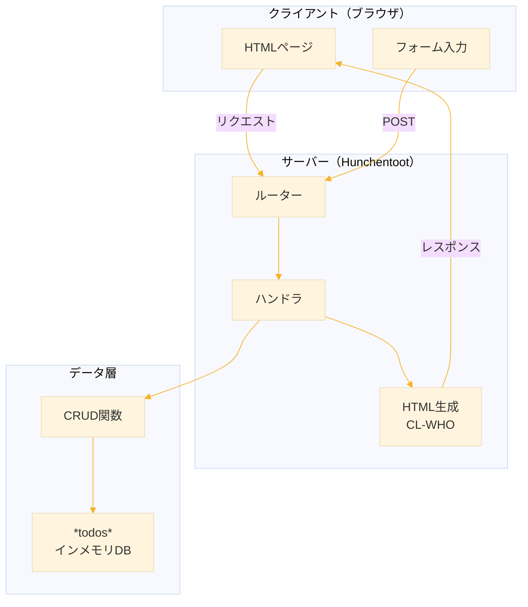
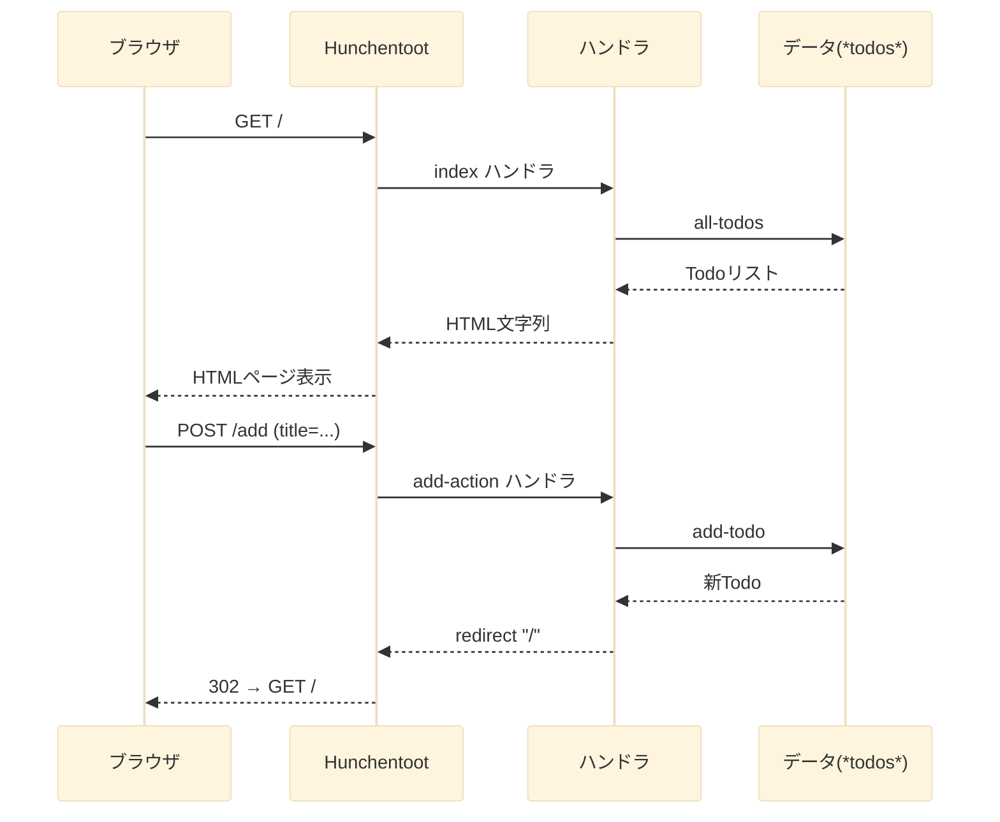
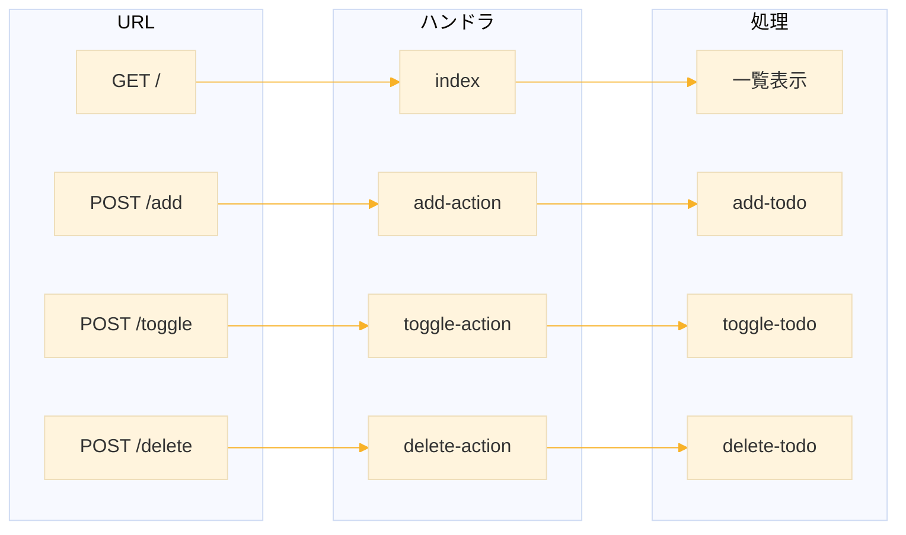
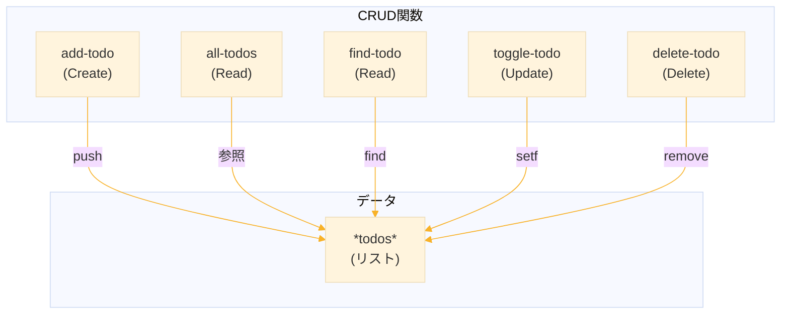
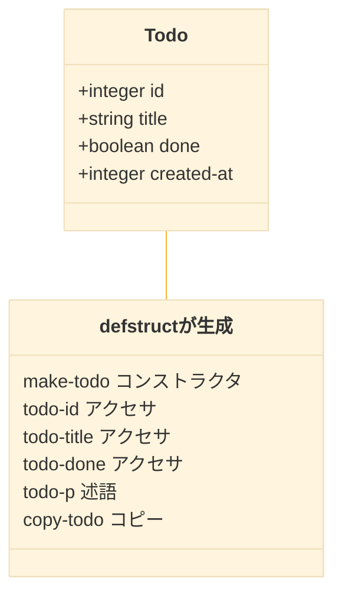
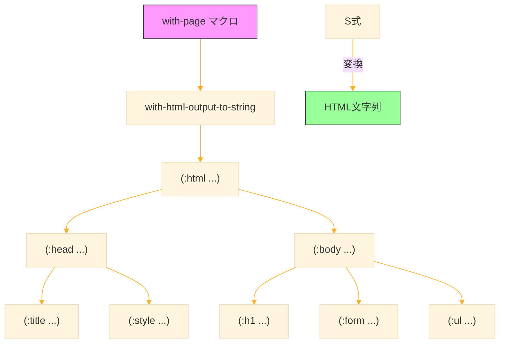
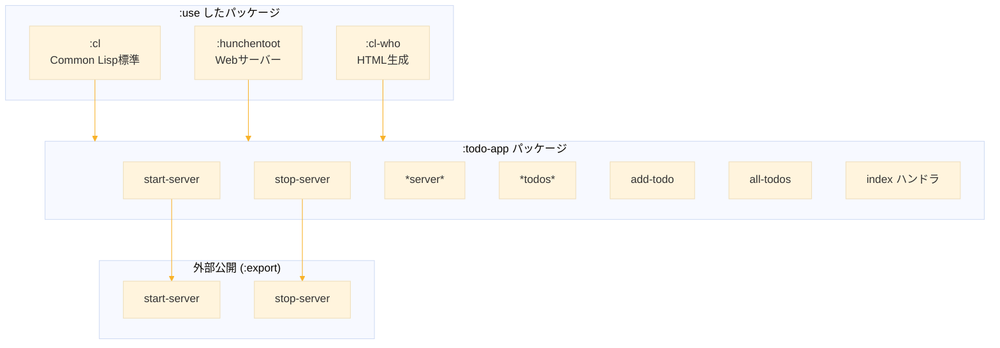
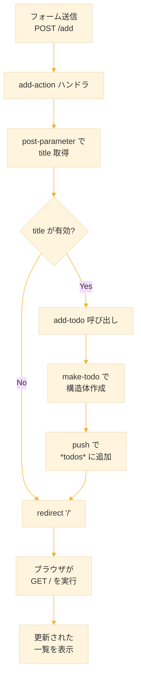

# Todo App - 構造図（Mermaid）

## 1. アプリケーション全体構成

```mermaid
%%{init:{'theme':'base',
  'themeVariables': {
    'lineColor': '#F8B229'
  },
  'flowchart':{'rankSpacing':60}}
}%%
flowchart TB
    subgraph Client["クライアント（ブラウザ）"]
        A[HTMLページ]
        B[フォーム入力]
    end
    
    subgraph Server["サーバー（Hunchentoot）"]
        C[ルーター]
        D[ハンドラ]
        E[HTML生成<br/>CL-WHO]
    end
    
    subgraph Data["データ層"]
        F[CRUD関数]
        G["*todos*<br/>インメモリDB"]
    end
    
    A -->|リクエスト| C
    C --> D
    D --> F
    F --> G
    D --> E
    E -->|レスポンス| A
    B -->|POST| C
```

## 2. リクエスト/レスポンス フロー

```mermaid
%%{init:{'theme':'base',
  'themeVariables': {
    'lineColor': '#F8B229'
  },
  'flowchart':{'rankSpacing':60}}
}%%
sequenceDiagram
    participant B as ブラウザ
    participant H as Hunchentoot
    participant D as ハンドラ
    participant M as データ(*todos*)
    
    B->>H: GET /
    H->>D: index ハンドラ
    D->>M: all-todos
    M-->>D: Todoリスト
    D-->>H: HTML文字列
    H-->>B: HTMLページ表示
    
    B->>H: POST /add (title=...)
    H->>D: add-action ハンドラ
    D->>M: add-todo
    M-->>D: 新Todo
    D-->>H: redirect "/"
    H-->>B: 302 → GET /
```

## 3. URLルーティング

```mermaid
%%{init:{'theme':'base',
  'themeVariables': {
    'lineColor': '#F8B229'
  },
  'flowchart':{'rankSpacing':60}}
}%%
flowchart LR
    subgraph URLs["URL"]
        U1["GET /"]
        U2["POST /add"]
        U3["POST /toggle"]
        U4["POST /delete"]
    end
    
    subgraph Handlers["ハンドラ"]
        H1["index"]
        H2["add-action"]
        H3["toggle-action"]
        H4["delete-action"]
    end
    
    subgraph Actions["処理"]
        A1["一覧表示"]
        A2["add-todo"]
        A3["toggle-todo"]
        A4["delete-todo"]
    end
    
    U1 --> H1 --> A1
    U2 --> H2 --> A2
    U3 --> H3 --> A3
    U4 --> H4 --> A4
```

## 4. CRUD操作

```mermaid
%%{init:{'theme':'base',
  'themeVariables': {
    'lineColor': '#F8B229'
  },
  'flowchart':{'rankSpacing':60}}
}%%
flowchart TD
    subgraph CRUD["CRUD関数"]
        C["add-todo<br/>(Create)"]
        R1["all-todos<br/>(Read)"]
        R2["find-todo<br/>(Read)"]
        U["toggle-todo<br/>(Update)"]
        D["delete-todo<br/>(Delete)"]
    end
    
    subgraph Storage["データ"]
        S["*todos*<br/>(リスト)"]
    end
    
    C -->|push| S
    R1 -->|参照| S
    R2 -->|find| S
    U -->|setf| S
    D -->|remove| S
```

## 5. Todo構造体

```mermaid
%%{init:{'theme':'base',
  'themeVariables': {
    'lineColor': '#F8B229'
  },
  'flowchart':{'rankSpacing':60}}
}%%
classDiagram
    class Todo {
        +integer id
        +string title
        +boolean done
        +integer created-at
    }
    
    class 自動生成["defstructが生成"]
    
    自動生成 : make-todo コンストラクタ
    自動生成 : todo-id アクセサ
    自動生成 : todo-title アクセサ
    自動生成 : todo-done アクセサ
    自動生成 : todo-p 述語
    自動生成 : copy-todo コピー
    
    Todo -- 自動生成
```

## 6. HTML生成フロー

```mermaid
%%{init:{'theme':'base',
  'themeVariables': {
    'lineColor': '#F8B229'
  },
  'flowchart':{'rankSpacing':60}}
}%%
flowchart TD
    A["with-page マクロ"] --> B["with-html-output-to-string"]
    B --> C["(:html ...)"]
    C --> D["(:head ...)"]
    C --> E["(:body ...)"]
    D --> F["(:title ...)"]
    D --> G["(:style ...)"]
    E --> H["(:h1 ...)"]
    E --> I["(:form ...)"]
    E --> J["(:ul ...)"]
    
    K["S式"] -->|変換| L["HTML文字列"]
    
    style A fill:#f9f,stroke:#333
    style L fill:#9f9,stroke:#333
```

## 7. パッケージ構成

```mermaid
%%{init:{'theme':'base',
  'themeVariables': {
    'lineColor': '#F8B229'
  },
  'flowchart':{'rankSpacing':60}}
}%%
flowchart TD
    subgraph TodoApp[":todo-app パッケージ"]
        E1["start-server"]
        E2["stop-server"]
        I1["*server*"]
        I2["*todos*"]
        I3["add-todo"]
        I4["all-todos"]
        I5["index ハンドラ"]
    end
    
    subgraph Used[":use したパッケージ"]
        CL[":cl<br/>Common Lisp標準"]
        HT[":hunchentoot<br/>Webサーバー"]
        WHO[":cl-who<br/>HTML生成"]
    end
    
    subgraph Export["外部公開 (:export)"]
        EX1["start-server"]
        EX2["stop-server"]
    end
    
    CL --> TodoApp
    HT --> TodoApp
    WHO --> TodoApp
    E1 --> EX1
    E2 --> EX2
```

## 8. 処理の流れ（Todo追加）

```mermaid
%%{init:{'theme':'base',
  'themeVariables': {
    'lineColor': '#F8B229'
  },
  'flowchart':{'rankSpacing':60}}
}%%
flowchart TD
    A["フォーム送信<br/>POST /add"] --> B["add-action ハンドラ"]
    B --> C["post-parameter で<br/>title 取得"]
    C --> D{title が有効?}
    D -->|Yes| E["add-todo 呼び出し"]
    D -->|No| G["redirect '/'"]
    E --> F["make-todo で<br/>構造体作成"]
    F --> H["push で<br/>*todos* に追加"]
    H --> G
    G --> I["ブラウザが<br/>GET / を実行"]
    I --> J["更新された<br/>一覧を表示"]
```
